# 🔍 Argus - The All-Seeing Code Guardian

An advanced AI-powered GitHub Action with multiple specialized agents that watch
over your code like the mythical hundred-eyed giant. Argus combines cutting-edge
AI models with static analysis to provide comprehensive, educational feedback on
pull requests.

## 🎯 Overview

Argus goes beyond traditional code review tools by deploying specialized AI
agents - the "Eyes of Argus" - each watching for different aspects of code
quality:

- **👁️ Security Eye**: Watches for vulnerabilities, auth issues, and data
  exposure risks
- **👁️ Logic Eye**: Deep analysis using Claude Code for business logic and edge
  cases
- **👁️ Architecture Eye**: Guards design patterns, SOLID principles, and code
  organization
- **👁️ Performance Eye**: Spots bottlenecks and optimization opportunities
- **🔧 Intelligent Linting**: Summarizes static analysis instead of comment spam
- **🧠 Context Awareness**: Understands your entire project like a senior
  developer
- **🎓 Developer Coaching**: Teaches while reviewing, tailored to experience
  level
- **📏 Scales Gracefully**: Handles large PRs with smart prioritization
  strategies
- **🧩 Learns & Adapts**: Evolves with your team's preferences over time

## 🏗️ Architecture

```mermaid
graph TB
    A[GitHub PR Event] --> B[File Change Detection]
    B --> C[Project Context Builder]
    C --> D[File Prioritizer]
    D --> E[Linting Coordinator]
    E --> F[Multi-Agent Orchestrator]

    F --> G[👁️ Security Eye]
    F --> H[👁️ Architecture Eye]
    F --> I[👁️ Logic Eye]
    F --> J[👁️ Performance Eye]
    F --> K[👁️ Testing Eye]

    G --> L[Review Synthesizer]
    H --> L
    I --> L
    J --> L
    K --> L

    L --> M[Coaching Engine]
    M --> N[GitHub Comments]
```



### The Eyes of Argus

1. **👁️ Multi-Agent Orchestrator**: The central eye that coordinates all other
   eyes
2. **🧠 Context Builder**: Analyzes project DNA - structure, frameworks, and
   patterns
3. **🎯 File Prioritizer**: Focuses the most powerful eyes on the highest-risk
   changes
4. **🔧 Linting Coordinator**: Integrates multiple static analysis tools
   intelligently
5. **⚡ Review Synthesizer**: Weaves insights from all eyes into coherent wisdom
6. **🎓 Coaching Engine**: Transforms findings into educational growth
   opportunities

## 🚀 Quick Start

### Installation

Add this workflow file to your repository at `.github/workflows/argus.yml`:

```yaml
name: Argus Code Guardian

permissions:
  contents: read
  pull-requests: write

on:
  pull_request:
    types: [opened, synchronize, ready_for_review]
  pull_request_review_comment:
    types: [created]

concurrency:
  group: ${{ github.repository }}-${{ github.event.number }}-argus-action
  cancel-in-progress: true

jobs:
  review:
    if: github.event.pull_request.draft == false
    runs-on: ubuntu-latest
    steps:
      - uses: actions/checkout@v4
        with:
          fetch-depth: 0

      - uses: n1lanjan/argus-action@main
        env:
          GITHUB_TOKEN: ${{ github.token }}
          ANTHROPIC_API_KEY: ${{ secrets.ANTHROPIC_API_KEY }}
          OPENAI_API_KEY: ${{ secrets.OPENAI_API_KEY }}
        with:
          strictness-level: 'standard'
          focus-areas: 'security,architecture,performance'
          learning-mode: true
```

### Configuration

| Parameter          | Description                                                     | Default                       |
| ------------------ | --------------------------------------------------------------- | ----------------------------- |
| `strictness-level` | Review strictness: `coaching`, `standard`, `strict`, `blocking` | `standard`                    |
| `focus-areas`      | Comma-separated focus areas                                     | `security,architecture,logic` |
| `learning-mode`    | Enable adaptive learning from feedback                          | `true`                        |
| `max-files`        | Maximum files to review (0 = no limit)                          | `50`                          |
| `enable-coaching`  | Provide educational feedback                                    | `true`                        |

## 👁️ The Eyes of Argus

### 🔒 Security Eye

_"The Vigilant Guardian"_

- Spots vulnerabilities like SQL injection, XSS, and auth bypasses
- Guards against data exposure and privacy leaks
- Validates cryptographic implementations and secure configurations

### 🏗️ Architecture Eye

_"The Design Sentinel"_

- Enforces SOLID principles and clean architecture
- Detects design pattern violations and coupling issues
- Guides modular design and dependency management

### 🧠 Logic Eye

_"The Reasoning Oracle"_ (Powered by Claude Code)

- Deep analysis of business logic and algorithmic correctness
- Identifies edge cases, race conditions, and logic flaws
- Provides context-aware insights with full codebase understanding

### ⚡ Performance Eye

_"The Speed Demon"_

- Hunts down bottlenecks and inefficient algorithms
- Spots memory leaks and resource waste
- Suggests optimizations for speed and scalability

### 🧪 Testing Eye

_"The Quality Assurance Master"_

- Evaluates test coverage and quality
- Identifies missing test scenarios
- Reviews testing patterns and best practices

## 📊 Features

### Intelligent Linting Integration

Instead of creating individual comments for every linting issue, Argus:

- Runs ESLint, TypeScript, Prettier, and other configured linters
- Summarizes findings in a single, organized comment
- Only flags issues that require human judgment
- Provides quick-fix suggestions where appropriate

### Context-Aware Reviews

The tool builds a comprehensive understanding of your project:

- **Framework Detection**: Automatically detects React, Vue, Express, etc.
- **Pattern Recognition**: Learns your team's coding patterns
- **Architecture Analysis**: Understands your project structure
- **Dependency Mapping**: Analyzes how changes affect other parts

### Large PR Handling

For large pull requests (>50 files), the tool:

- Uses semantic chunking to group related changes
- Provides architectural-level summaries
- Focuses on high-risk changes first
- Runs agents in parallel for efficiency

### Developer Coaching

Based on the developer's experience level and past feedback:

- Provides educational context for suggestions
- Explains why certain patterns are problematic
- Suggests learning resources
- Adapts feedback complexity to skill level

## 🔧 Development

### Local Development

```bash
# Clone the repository
git clone https://github.com/your-org/argus.git
cd argus

# Install dependencies
npm install

# Build the project
npm run build

# Run tests
npm test

# Package for distribution
npm run package
```

### Testing

```bash
# Run unit tests
npm test

# Run integration tests
npm run test:integration

# Test with sample PR
npm run test:sample-pr
```

## 📈 Metrics & Analytics

The tool tracks and improves over time:

- **Review Quality Score**: Based on developer feedback
- **False Positive Rate**: Issues marked as irrelevant
- **Learning Effectiveness**: Improvement in subsequent reviews
- **Coverage Metrics**: Percentage of critical issues caught

## 🛡️ Security & Privacy

- **No Code Storage**: Code is analyzed in-memory only
- **Encrypted Communication**: All API calls use HTTPS
- **Token Scoping**: Minimal required GitHub permissions
- **Audit Logging**: All AI interactions are logged for transparency

## 🤝 Contributing

We welcome contributions! Please see our [Contributing Guide](CONTRIBUTING.md)
for details.

### Development Setup

1. Fork the repository
2. Create a feature branch
3. Make your changes
4. Add tests for new functionality
5. Submit a pull request

## 📄 License

MIT License - see [LICENSE](LICENSE) file for details.

## 🆘 Support

- **Issues**: [GitHub Issues](https://github.com/your-org/argus/issues)
- **Discussions**:
  [GitHub Discussions](https://github.com/your-org/argus/discussions)
- **Documentation**: [Wiki](https://github.com/your-org/argus/wiki)

## 🔮 Roadmap

- [ ] Visual Studio Code extension
- [ ] GitLab support
- [ ] Custom rule engine
- [ ] Team analytics dashboard
- [ ] Integration with more static analysis tools
- [ ] Multi-language support expansion
